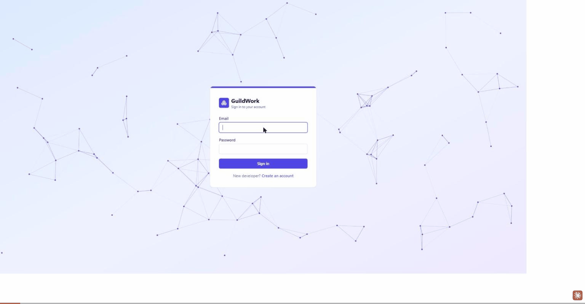

# GuildWork



GuildWork is a project-management system for a software consultancy: Admins and Project Managers run clients, projects, and bug tracking, while Developers see only the projects they're assigned to and manage their own skill profile. The domain concept is original to this build — loosely inspired by a prior academic team project, but designed and implemented from scratch on a different stack.

## Architecture

- **backend/** — Node.js + TypeScript + Express, PostgreSQL via Prisma. Thin route handlers, independently testable auth/authorization modules, zod-validated input.
- **frontend/** — Vite + React + TypeScript + Tailwind CSS, React Router, TanStack Query for server state, Recharts for analytics.
- npm workspaces monorepo (`backend`, `frontend`), one root `package.json` orchestrating both.

## Authentication & Authorization

### Token design

GuildWork uses a two-token JWT scheme rather than a single long-lived token, so a stolen access token has a short blast radius and sessions can be revoked server-side:

- **Access token** — 15 minutes, signed JWT, returned in the response body only and held **in memory** on the client (never `localStorage`/`sessionStorage`). Anything an XSS payload can read back out of persistent browser storage is a stolen-session risk; an in-memory value disappears the moment the tab closes. It's sent as `Authorization: Bearer <token>` on every request.
- **Refresh token** — 30 days, an opaque random value delivered in an `httpOnly`, `SameSite=Strict` cookie. The client never touches its value directly, which is what makes it safe to live longer than the access token. Only its SHA-256 hash is stored server-side (in `RefreshToken`, with `expiresAt`/`revokedAt`), so a leaked database dump can't be replayed as a valid session.
- **Rotation on refresh** — `POST /api/auth/refresh` looks up the hash, revokes that row, and issues a brand-new access+refresh pair. If a caller ever presents a refresh token whose row is *already* revoked, that's the standard signal of token replay (a stolen cookie used after the legitimate client already rotated past it) — every refresh token for that user is immediately revoked and the request rejected.
- The frontend's fetch wrapper (`src/api/client.ts`) catches a 401, attempts one silent refresh via the cookie, and replays the original request exactly once — so the 15-minute expiry is invisible during normal use.

### Role model

Three roles, enforced on the server (the UI just hides actions that would 403, for a better experience — never treat it as the real gate):

| Route / action | Admin | Project Manager | Developer |
|---|---|---|---|
| Manage clients (CRUD) | ✅ | ✅ | ❌ (403) |
| Create/edit/delete projects | ✅ | ✅ | ❌ (403) |
| List **all** projects | ✅ | ✅ | ❌ — sees only assigned projects |
| View a project's detail | ✅ | ✅ | Only if assigned (404 otherwise, not 403) |
| Assign/unassign developers | ✅ | ✅ | ❌ (403) |
| Create/delete bugs | ✅ | ✅ | ❌ (403) |
| Edit any field on a bug | ✅ | ✅ | Only `status` + `notes`, only on bugs assigned to them |
| Reassign a bug / change severity | ✅ | ✅ | ❌ (403), even on their own bug |
| Manage the skills catalog | ✅ | ✅ | Read-only |
| Manage their own skills/bio | ✅ | ✅ | ✅ (self only) |
| View all developer profiles | ✅ | ✅ | ❌ (403) — sees only their own |
| Change a user's role | ✅ | ❌ (403) | ❌ (403) |
| View analytics | ✅ | ✅ | ❌ (403) |
| Download a project's PDF report | ✅ | ✅ | Only if assigned |

Two status codes matter here in a specific way: **403** means "you don't have the role for this at all," while **404** means "this resource doesn't exist from your vantage point" — a Developer requesting a project they aren't assigned to gets 404, not 403, so they can't use the status code to probe which projects exist.

## Tech stack

Express, Prisma, PostgreSQL, zod, bcrypt, jsonwebtoken, pdfkit, express-rate-limit · React, Vite, Tailwind CSS, React Router, TanStack Query, Recharts · Vitest (+ Testing Library on the frontend) for both workspaces.

## Local setup

```bash
git clone https://github.com/JuanCMath/guildwork.git
cd guildwork
npm install
```

Copy the env templates and fill in real values:

```bash
cp backend/.env.example backend/.env
cp frontend/.env.example frontend/.env
```

`backend/.env` needs `DATABASE_URL`, `PORT`, `FRONTEND_ORIGIN`, `JWT_ACCESS_SECRET`, `JWT_REFRESH_SECRET`. `frontend/.env` needs `VITE_API_URL`.

Start Postgres (dev-only container):

```bash
docker compose up postgres -d
```

Generate the Prisma client and run migrations:

```bash
npm run prisma:generate --workspace=backend
npm run prisma:migrate --workspace=backend
```

Optionally seed demo data (an Admin, two PMs, five Developers with skills/seniority/mentors, two clients, three projects with assignments and bugs — everyone's password is `Password123!`):

```bash
npx prisma db seed --workspace=backend
```

Run both apps in dev mode (in separate terminals):

```bash
npm run dev --workspace=backend
npm run dev --workspace=frontend
```

## Testing

```bash
npm test --workspace=backend   # Vitest, Prisma mocked — no live DB needed
npm test --workspace=frontend  # Vitest + React Testing Library
```

The backend suite prioritizes the authorization matrix above everything else: for a representative set of routes it asserts Admin/PM/Developer get the right response for the same request, including the bug field-level restriction and the refresh-token reuse-detection path.

## Deployment

- **Frontend** → Vercel (static build of `frontend/`, set `VITE_API_URL` to the deployed backend URL).
- **Backend** → Railway (or any Node host with a managed Postgres add-on). Set `DATABASE_URL`, `FRONTEND_ORIGIN` (the deployed frontend origin), `JWT_ACCESS_SECRET`, `JWT_REFRESH_SECRET` to real, unique secrets — never reuse the `.env.example` placeholders.
- In production, the refresh cookie must be issued with `Secure` (HTTPS only) in addition to `httpOnly`/`SameSite=Strict` — the cookie helper already does this automatically based on `NODE_ENV=production`.

## License

MIT — see [LICENSE](./LICENSE).
